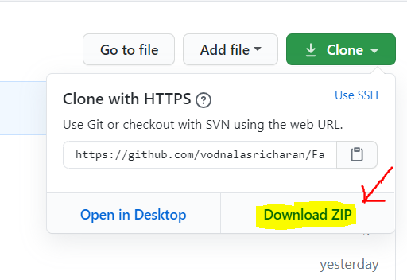
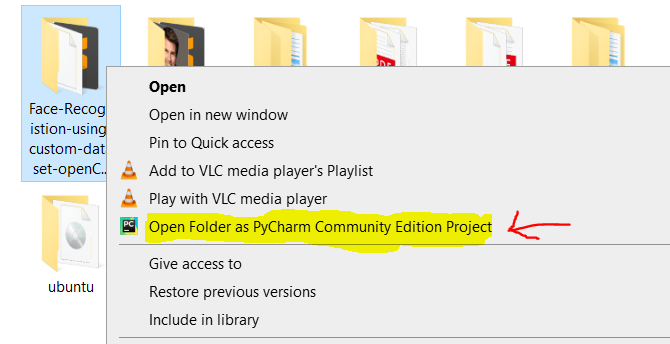
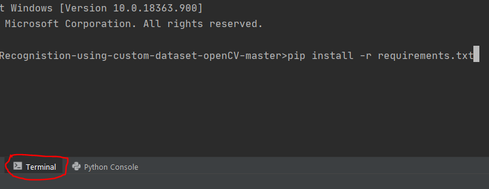
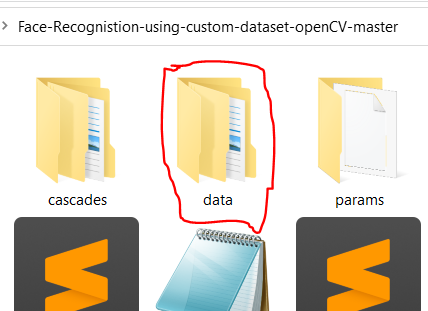
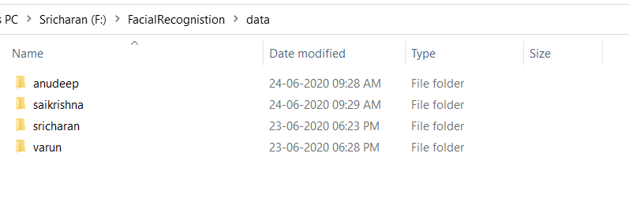
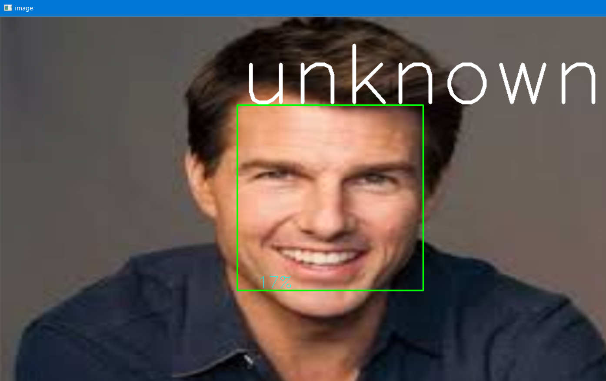

# Face-Recognistion-using-custom-dataset-openCV
## This project is done for Fun,to recognize the faces of me and my friends
First download the zip file of repository and extract it

     

 After that you can see a folder named Face-Recognisition-using-custom-dataset-openCV
 Right click on the folder and click on pycharm open as project (you can use your favourite IDE if any)

     

 <h5>Set the project interpreter in virtual environment(Now I can't tell you how to set virtual environment in pycharm🤷‍♀️,you can search in youtube or google it to know how to set virtual environment)</h5> 
Make sure you install all the required libraries mentioned in requirements.txt
 &ensp;&ensp;To install open terminal in pycharam and type
 &ensp;&ensp;&ensp;&ensp;pip install -r requirements.txt 

     

(If you still face any issues after executing any code snippet,kindly install the libraries manually😏 and run again)
 In this repository 
  &ensp;&ensp;&ensp;&ensp;faces.py
  &ensp;&ensp;&ensp;&ensp;face_image.py 
 are used to detect the faces in the image
 I used harcascade facedetection data which is used in these code snippets ...please ensure that you provide the correct path if you changed the files

### I have done this in two ways
       1)Using vgg16() as recognizer(which didn't give satisfying results)
       2)Using opencv face LBPHFaceRecognizer
## Using vgg16()
        used fies are:
              load_data.py
              model.py
              faces_train.py
              predict.py(for image prediction)
              face_image.py(also for image prediction...just checked if anything other works well)
              video-predict.py(for live video prediction)
I can't provide all the dataset to you as it is custom dataset made by me.😊
 Run the codes in the same order as provided✌
 To load data using load_data.py the data should be put in a data folder and images in their respective folders of their label name 

     

 

     

 Then run faces_train.py
 It takes .csv file and directory of the images obtained by load_data.py
 If you want you can place all these images obtained by load_data.py in a directory(folder) named train
 After sucessfull execution of all the above codes .....fianlly you can run any prediction code(predict.py/face_image.py/video-predict.py)
<h4>The results are not satisfactory as the dataset near me is not balanced.If you want you can try this on your custom dataset😉</h4>

## Using LBPHFaceRecognizer
              
              used files are:
                     data_load2.py
                     training.py
                     recognizer_img.py(for image prediction)
                     recognizer_video.py(for video prediction)
 Same as above create a data folder with images in their respective folders of their label name.
 Run the codes in the above sequence😃
 The output looks something like this(It detects other persons as unknown,whose images are not included in training data) 

     

 If you have more number of images then use this model,It is giving good results if you have more images.But as harcascade doesn't recognize faces which faces sidewards,This is a major drawback.
 If you're having private third party xml file,then you can use it.
<h4>This model is giving bit stable and acuurate results for me.Hope this works on your dataset too🤞</h4>

